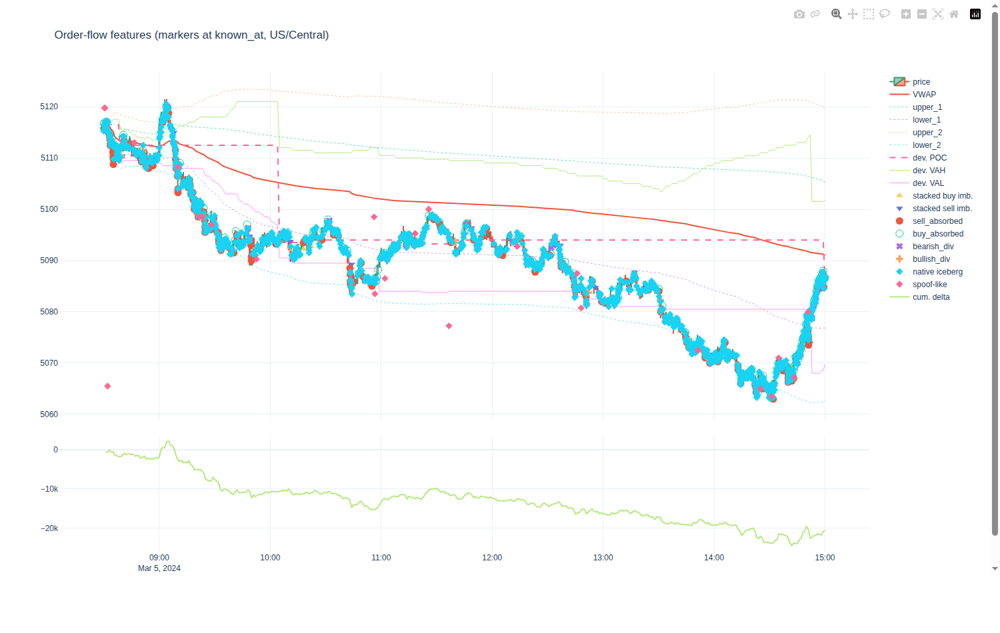

# Visual check of the 2024-03-05 RTH day chart (routine R2.4)

`scripts/plot_day.py --date 2024-03-05 --rth-only --mbo` (cached data, $0), screenshot by headless
Chromium. Interactive HTML: `reports/day-2024-03-05.html` (not in git; regenerate locally).

Looks right:
- ESH4 price 5060–5122, RTH 08:30–15:00 CT; cumulative delta falls to ≈ −24k with the sell-off
  and peaks with the 09:05 high; VWAP, bands, developing POC/VAH/VAL behave plausibly.

Found and fixed (this is why a visual check is worth doing):
1. **Iceberg markers far from the market** (e.g. ~5117 at 13:00 with price near 5090). Cause: CME
   orders **modified into the market and fully filled** — the order trades under its own id at the
   market price, then its old resting entry is deleted. `annotate_mbo` compared that fill with the
   old displayed size and called it iceberg evidence. Rule now: an `F` at a price other than the
   order's resting price is **aggressor volume** (`fill_aggressor` on the F row; the old entry
   becomes `aggressor_removal` or `modify_price_fill`). RTH counts: aggressor fills 1,851 →
   19,045 lots (5,211 fully filled orders), hidden reserve 7,226 → 6,536, native icebergs
   1,540 → 1,432; accounted fills still 100%.
2. `native_icebergs` counted any later size increase on a partly filled order as a refill, even hours
   later; now only inside the fill's event (7 detections removed).

Still noisy by design: absorption and native-iceberg markers cover most of the price path (1,432
icebergs, mostly 1-lot clips). Fine for a viewer; strategies must filter by size/volume.
